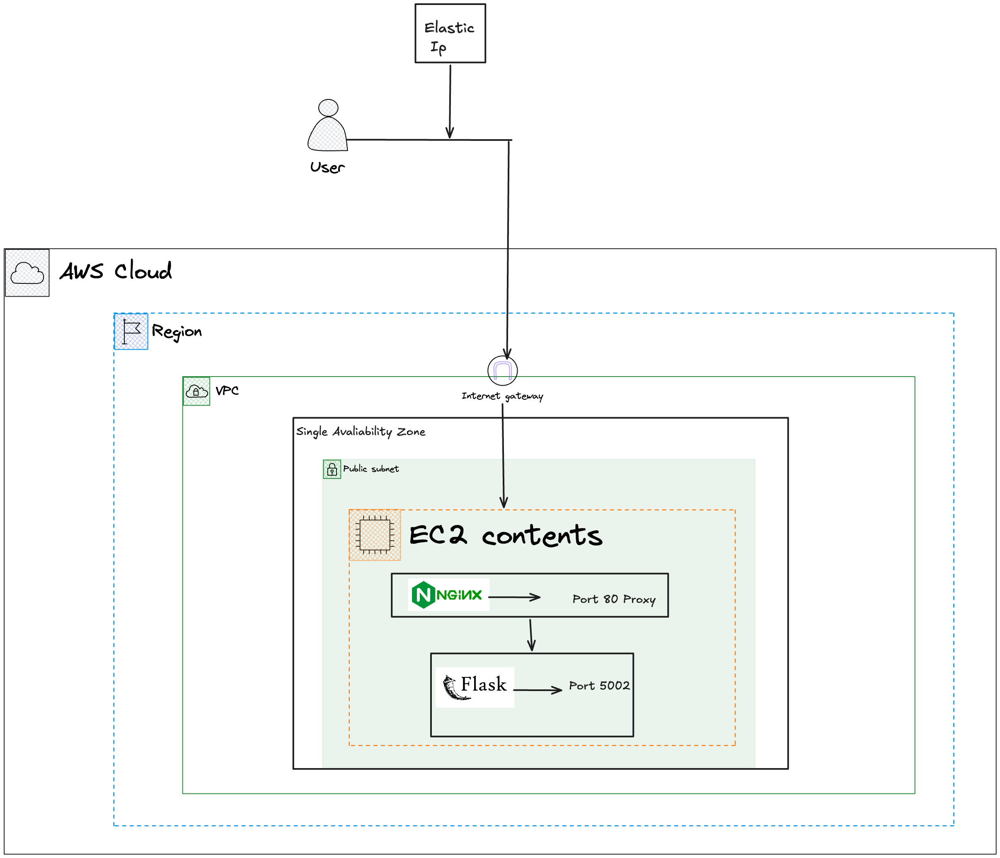

## EC2 to ECS Migration

     

This project simulates what real cloud migration would look like in a production grade enviornmet. By taking a legacy EC2 application and migrating it to a modernised, containerised ECS Fargate launch type with established networking, Continious Intergration and Continious Deployment, and Observability. Furthermore by Implementing a Cutover plan to document the process between each switch 

## Before EC2 Migration, Architecture Diagram

    

## After EC2 Migration, ECS Architecture Diagram

    

## Explanation of ECS Architecture Diagram

- Users Sends traffic through Cloudflare Delegaton and hands over Authoratative access to Route53 in order to look up for Name Servers
- Traffic goes through Route53 Directly into Internet Gateway; which allows VPC to have access to Public Internet
- After Interent Gateway, traffic reaches the ALB, which sits in the public subnet. With Security Group attached to the application load balancer which acts as a firewall only allowing port 80 and port 443 traffic from anywhere. 
- Inside the ALB, It contains Two Listeners which waits for HTTPS and HTTP Traffic while the Target Group distributes traffic tasks depending on which application, for this instance is the ECS with only Port 5002 Configured.
- A seperate security group is attached to the ecs tasks, allowing traffic on port 5002 from ALB security group - making sure that there isn't any exposed access to the internet as it contains heavy senstive confidental information.
- To be able to Pull Images and Continously log information into ECR & Cloudwatch, have private subnets have an outbound rule to public subnet which NAT Gateway, which is used if you want your private subnet to allow access to the internet without having inbound exposure. Since the we need to autonomously have it where ecs is receving the latest Docker image while also keeping in check for Logging Cloudwatch Metrics and viewing them in Dashboard.

- Developer run mutlitple workflows through GitHub Actions. within each workflow, it builds the docker image and provisions the infrastructure via Terraform, alongside Remote terraform.tfstate stored in S3 bucket -> enabling collaboration between other collaborates and peers.

- Monitor Failed ECS Deployments Via AWS EventBridge -> Cloudwatch Logs + Alarms

## Components used

* Cloudflare Provider inbuked in terraform + Using API Token for Automating and Updating Records at the Same time when Deploying Application.
* Docker Mutli Stage Image used for Less storage and Cost effecient -> Quicker runtime for the Image being Built
* Configured OpenID Connect between Github Actions and AWS for short lived credentials and no more static keyes being stored
* Modularised Terraform into 7 modules for Reusability and Organizaton, Consistency and Collaboration
* Switched Legacy EC2 from Amazon Linux to Ubuntu for consistency.

## Full Migration Strategy

The Full Migration Strategy is 